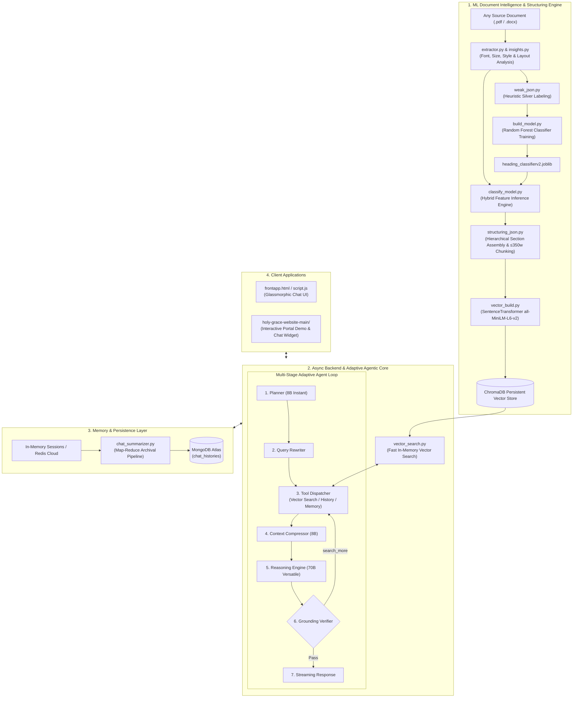

# 🧠 Adaptive Document Intelligence & Multi-Agent RAG System

[](https://www.python.org/)
[-green.svg)](https://pgjones.gitlab.io/quart/)
[-orange.svg)](https://groq.com/)
[](https://www.trychroma.com/)
[-yellow.svg)](https://scikit-learn.org/)
[](https://www.mongodb.com/atlas)

An end-to-end, **domain-agnostic Document Structure Understanding (DSU) & Adaptive Multi-Agent Retrieval-Augmented Generation (RAG) platform**.

Feed any document (`.pdf` or `.docx`) into the system—the pipeline automatically analyzes typographic and visual hierarchies using a custom Machine Learning classifier, reconstructs semantic sections, builds a vector index, and dynamically adapts the conversational AI agent to answer queries grounded strictly in the provided knowledge base.

> 💡 **Demo Reference**: The included *"GraceBot"* and Holy Grace Academy portal serve as a complete real-world benchmark demonstrating how the system seamlessly adapts to institutional and academic documents.

---

## 🌟 Why This Project Exists

### The Core Problem with Standard RAG
Standard RAG frameworks rely on **naive, fixed-window chunking** (e.g. splitting every 500 characters). When applied to structured documents (manuals, academic guidelines, policy documents, legal contracts, research reports):
1. **Loss of Heading Context**: Headings get severed from their explanatory body text. When a paragraph is retrieved, the LLM has no idea what section, clause, or policy it refers to.
2. **Layout & Formatting Traps**: PDFs contain variable font sizes, irregular bolding, hyphenated line wraps across breaks, headers/footers, and irregular table layouts that produce corrupt tokens.
3. **Hallucination in Unconstrained Retrieval**: Standard setups attempt to answer even when the retrieved context lacks sufficient evidence.

### The Adaptive Solution
* **Universal Document-Adaptive Pipeline**: Drop any PDF or DOCX into the project root. The system extracts layout statistics, classifies headings using Machine Learning, and re-indexes the vector space on the fly.
* **ML-Powered Structure Understanding**: A trained Random Forest classifier analyzes 20 layout, typographic, and positional features per text line to distinguish headings from paragraphs regardless of document styling variations.
* **Hierarchical Semantic Sectioning**: Text is grouped strictly under parent headings and repaired (resolving hyphenations and squashed tokens) before chunking and embedding.
* **Multi-Agent Reasoning & Grounding Loop**: An autonomous multi-agent pipeline (Planner $\rightarrow$ Query Rewriter $\rightarrow$ Tool Dispatcher $\rightarrow$ Context Compressor $\rightarrow$ Reasoning Engine $\rightarrow$ Fact Grounding Verifier) verifies evidence before streaming final answers.
* **Persistent Memory & Map-Reduce Archival**: Maintains sliding in-session memory while automatically executing hierarchical map-reduce summarization into MongoDB Atlas when sessions conclude.

---

## 🏗️ System Architecture



---

## 📂 Repository Structure

```
Mini-Project-Colab/
├── config.json                     # Active ML model and classification confidence threshold
├── apis.py                         # API keys & endpoints (Groq, MongoDB Atlas, Redis)
├── requirements.txt                # Python dependencies
├── DocBuildRules.md                # PDF layout constraints & structural rules
├── call_test.py                    # Automated document discovery & vector DB builder
├── start.bat / start.sh            # One-click automated startup scripts
├── heading_classifier.joblib       # Trained ML model (v1: 13 features)
├── heading_classifierv2.joblib     # Trained ML model (v2: 20 features)
├── structured.json                 # Structured document chunks ready for embedding
├── weak_labels_final.json          # Silver labels dataset for ML training
│
├── backend.py                      # Primary streaming async Quart backend
├── agantic_back_optimized.py       # Rate-limit optimized multi-agent backend
├── agantic_back.py                 # Multi-agent backend with full reasoning loop
├── redis_backend.py                # Distributed Redis-backed session backend
├── chat_summarizer.py              # Map-reduce end-of-session archival module
│
├── rag_engine/                     # Core Document Ingestion & RAG Subsystem
│   ├── vector_search.py            # SentenceTransformer + ChromaDB query engine
│   └── converters/
│       ├── vector_build.py         # Chunks encoder & ChromaDB indexer
│       ├── structuring_json.py     # Document assembler & section chunker
│       └── extract_classify/       # ML Document Intelligence Engine
│           ├── extractor.py        # PDF line, layout & font extraction (pdfplumber)
│           ├── insights.py         # Statistical analysis of doc font/size hierarchy
│           └── classify_model.py   # Hybrid ML classifier inference (v1 / v2)
│
├── model_buiding_pipeline/         # ML Model Training & Dataset Generation Subsystem
│   ├── build_model.py              # Random Forest training pipeline
│   ├── weak_json.py                # Rule-based silver dataset generator
│   ├── function.py                 # Line-by-line inspection & data validation tool
│   ├── extractor.py                # Pipeline document extractor
│   └── insights.py                 # Pipeline font hierarchy analyzer
│
├── frontapp.html                   # Modern glassmorphic standalone chat application
├── script.js                       # Frontend state, session sync & SSE streaming client
│
└── holy-grace-website-main/        # Benchmark / Demo Institutional Portal
    ├── index.html                  # Example portal homepage
    ├── chatbot.html                # Dedicated chatbot page with quick FAQ prompts
    ├── styles.css                  # UI styles
    ├── script.js                   # Client script with marked.js markdown rendering
    ├── holy grace website/         # Alternative template package
    └── images/                     # Imagery and branding assets
```

---

## ⚡ Tech Stack & Key Libraries

| Component | Technologies Used |
| :--- | :--- |
| **Async Web Server** | [Quart](https://pgjones.gitlab.io/quart/), `quart-cors`, Python `asyncio` |
| **LLM Inference** | [Groq Cloud SDK](https://groq.com/) (`llama-3.1-8b-instant`, `llama-3.3-70b-versatile`) |
| **Vector Database** | [ChromaDB](https://www.trychroma.com/) (`PersistentClient`) |
| **Embedding Model** | [Sentence-Transformers](https://sbert.net/) (`all-MiniLM-L6-v2`) |
| **ML & Classification** | `scikit-learn` (`RandomForestClassifier`), `joblib` |
| **Document Processing** | `pdfplumber`, `python-docx`, `docx2pdf`, `wordsegment` |
| **Database & Caching** | [MongoDB Atlas](https://www.mongodb.com/atlas) via `motor`, [Redis Cloud](https://redis.com/) via `redis[hiredis]` |
| **Frontends** | Vanilla HTML5/CSS3 (Glassmorphism), JavaScript (Fetch Streams, SSE), `marked.js` |

---

## 🚀 Quickstart & Setup Guide

### 1. Prerequisites
* **Python 3.10+** installed
* **Groq API Key** ([Get one here](https://console.groq.com/))
* **MongoDB Atlas URI** (Free tier cluster)
* *(Optional)* **Redis Cloud Instance** (only needed if running `redis_backend.py`)

### 2. Clone and Install Dependencies
```bash
git clone https://github.com/your-username/Mini-Project-Colab.git
cd Mini-Project-Colab

# Create and activate a virtual environment
python -m venv venv
# On Windows:
venv\Scripts\activate
# On Linux/macOS:
source venv/bin/activate

# Install requirements
pip install -r requirements.txt
```

### 3. Configure Credentials & Connections
Open `apis.py` and supply your API keys:
```python
# apis.py
api = "gsk_your_groq_api_key"
mongo_uri = "mongodb+srv://<user>:<password>@cluster0.mongodb.net/?appName=KnowledgeBot"

# (Optional for redis_backend.py)
redis_pass = "your_redis_password"
redis_public_endpint = "redis-15462.c15.us-east-1-2.ec2.cloud.redislabs.com:15462"
```

### 4. Configure ML Inference Settings
Edit `config.json` to configure the active heading classifier model and confidence threshold:
```json
{
    "active_model": "heading_classifierv2.joblib",
    "heading_threshold": 0.70,
    "description": "Configuration for the RAG Engine document classification pipeline."
}
```

---

## 📖 How to Ingest Custom Documents & Use the System

### Step 1: Ingest Any Custom Document
You can provide any `.pdf` or `.docx` document as your knowledge source:
1. Place your target `.pdf` or `.docx` file in the project root directory.
2. Run the automated ingestion processor:
```bash
python call_test.py
```
**What happens automatically:**
* `.docx` documents are converted to `.pdf` via `docx2pdf`.
* `extractor.py` reads words, bounding boxes, font weights, and point sizes.
* `classify_model.py` uses the ML classifier to predict structural headings.
* `structuring_json.py` stitches sentences, resolves hyphenations, and groups content under headings into `structured.json`.
* `vector_build.py` encodes each chunk with `all-MiniLM-L6-v2` and indexes them into persistent `ChromaDB`.

---

### Step 2: Choose and Run a Backend Server

#### Option A: Rate-Limit Optimized Multi-Agent Backend (Recommended)
Features the 7-stage planner/verifier pipeline, query rewrites, and exponential backoff:
```bash
python agantic_back_optimized.py
```

#### Option B: Fast Direct Streaming RAG Backend
Direct async streaming backend with in-memory session management:
```bash
python backend.py
```

#### Option C: Distributed Redis-Backed Backend
Uses Redis Cloud for horizontally scalable session management:
```bash
python redis_backend.py
```

*The backend server will start at `http://127.0.0.1:5000`.*

---

### Step 3: Launch the Frontend Interface

1. **Standalone Glassmorphic Web App**:
   - Open `frontapp.html` directly in any web browser.
   - Features real-time token streaming, lead capture (name & contact), and session history sync.

2. **Benchmark Portal Demo**:
   - Open `holy-grace-website-main/index.html` or `holy-grace-website-main/chatbot.html`.

---

### Step 4: One-Click Startup Script

To ingest documents and boot the server in a single command:

* **On Windows**: Run `start.bat`
* **On Linux/macOS**: Run `./start.sh`

---

## 🧠 In-Depth: Multi-Agent Pipeline Workflow

When a query is received in `agantic_back_optimized.py`, the autonomous agent loop adapts dynamically:

```
[User Prompt]
      │
      ▼
0. [Auto Name Extractor] ──> Extracts user name via regex without LLM overhead
      │
      ▼
1. [Conservative Planner] ──> (Llama 3.1 8B) Decides necessary tools: ["search", "history_lookup", "memory_lookup"]
      │
      ▼
2. [Query Rewriter] ───────> Expands abbreviations & domain jargon into dense search queries
      │
      ▼
3. [Tool Execution] ───────> Dispatches vector search (top_k=5), history match, or memory fetch
      │
      ▼
4. [Context Compressor] ───> Compresses retrieved chunks into a dense factual context
      │
      ▼
5. [Reasoning Engine] ─────> (Llama 3.3 70B) Synthesizes a grounded draft answer (≤200 tokens)
      │
      ▼
6. [Verifier Agent] ───────> Validates draft grounding:
      │                       ├─ Pass ────────────> Proceed to step 7
      │                       └─ "search_more" ───> Triggers expand_search (top_k=10) & re-evaluates
      ▼
7. [Final Streamer] ───────> Streams formatted Markdown response to client in real-time
```

---

## 🗄️ In-Depth: Memory & Session Archival

1. **Sliding In-Session Memory** (`update_memory_summary`):
   - Every 6 conversation turns (`HISTORY_THRESHOLD = 6`), the lightweight 8B model summarizes persistent facts into the active session memory.
2. **Background Session Sweeper** (`session_monitor`):
   - Background async worker sweeps for inactive sessions nearing expiry (10-minute timeout) and triggers archival before clearing RAM.
3. **Map-Reduce Archival Pipeline** (`chat_summarizer.py`):
   - Splits chat history into token-budgeted chunks respecting user-assistant pairs.
   - Summarizes chunks in parallel respecting Groq API rate limits (with automatic delay pacing).
   - Merges segments into a polished permanent record and stores it in MongoDB Atlas (`gracebot.chat_histories`).

---

## 🛠️ Retraining or Customizing the ML Heading Classifier

To train a new classifier for specialized document sets:

1. Place sample training PDFs inside `modularity/pdfs/`.
2. Generate silver labels using weak supervision heuristics:
   ```bash
   python model_buiding_pipeline/weak_json.py
   ```
3. Inspect and curate line labels interactively:
   ```bash
   python model_buiding_pipeline/function.py
   ```
4. Train the Random Forest model:
   ```bash
   python model_buiding_pipeline/build_model.py
   ```
5. The output `heading_classifierv2.joblib` will be exported with the label maps and feature order ready for runtime classification.

---

## 🔌 API Endpoints Reference

### `POST /stream-chat`
Initiates real-time SSE / chunked token streaming for chat completions.
* **Payload**:
  ```json
  {
    "prompt": "What are the rules and guidelines described in the document?",
    "session_id": "33f3716b-b421-48ee-9175-a5028accd94e"
  }
  ```
* **Response**: `text/plain` streaming chunks.

### `GET /get-session`
Initializes a new session UUID and initializes memory tracking.
* **Response**: `{ "session_id": "4e782ec...-uuid" }`

### `POST /get_userinfo`
Associates user metadata (lead generation) with the current session.
* **Payload**:
  ```json
  {
    "session_id": "4e782ec...-uuid",
    "name": "Alex",
    "contact": "+91 9876543210"
  }
  ```

### `POST /get-history`
Fetches conversation history for a given session.
* **Payload**: `{ "session_id": "..." }`
* **Response**: `{ "history": [ { "role": "user", "content": "..." }, ... ] }`

---

## 📄 License & Attribution

Developed with focus on **Document Structure Understanding (DSU)**, **Adaptive Knowledge RAG**, and **Multi-Agent Conversational AI**.  
Licensed under the [MIT License](LICENSE).
